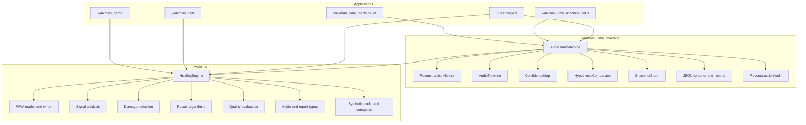
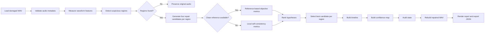
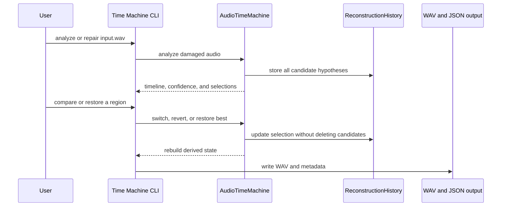

# WalkMan

WalkMan is a dependency-light C++20 audio restoration toolkit for damaged
PCM WAV recordings. It detects suspicious waveform regions, generates several
repair hypotheses, ranks those hypotheses, reconstructs the audio, and reports
what changed and why.

The project also includes the Audio Time Machine extension. It preserves every
candidate reconstruction as a navigable hypothesis, exposes a timeline and
confidence map, supports manual switching and reversion, and provides
snapshot-based restoration of previous decisions.

WalkMan is designed for reproducible experiments, command-line workflows,
notebook-style demonstrations, and integration into larger C++ applications.

## Table of Contents

1. ### [Highlights](#highlights)
2. ### [Capabilities](#capabilities)
3. ### [Architecture](#architecture)
4. ### [Processing flow](#processing-flow)
5. ### [Repair strategies](#repair-strategies)
6. ### [Audio Time Machine](#audio-time-machine)
7. ### [Project layout](#project-layout)
8. ### [Requirements](#requirements)
9. ### [Build from source](#build-from-source)
10. ### [Run the original WalkMan demo](#run-the-original-walkman-demo)
11. ### [Run the Audio Time Machine CLI](#run-the-audio-time-machine-cli)
12. ### [CLI reference](#cli-reference)
13. ### [Use the libraries from C++](#use-the-libraries-from-c)
14. ### [Notebook walkthroughs](#notebook-walkthroughs)
15. ### [Docker](#docker)
16. ### [Testing and verification](#testing-and-verification)
17. ### [Input and output behavior](#input-and-output-behavior)
18. ### [Scoring and confidence](#scoring-and-confidence)
19. ### [Troubleshooting](#troubleshooting)
20. ### [Extension points](#extension-points)
21. ### [Limitations](#limitations)

## Highlights

| Area | Implementation |
| --- | --- |
| Language | C++20 |
| Build system | CMake 3.20 or newer |
| Audio container | RIFF/WAVE |
| Supported sample formats | PCM 8, 16, 24, and 32 bit, plus IEEE float 32 and 64 bit |
| Channel layout | Mono, stereo, and interleaved multichannel audio |
| Runtime dependencies | None required beyond the C++ standard library and the platform math library on Unix-like systems |
| Spectral processing | Internal deterministic radix-2 FFT |
| Repair candidates | Linear interpolation, spline interpolation, waveform matching, and spectral repair |
| Reproducibility | Deterministic synthetic audio and corruption generation |
| Test coverage | Original WalkMan smoke test and Audio Time Machine integration test |
| Current source/configuration size | More than 5,000 non-empty lines |

## Capabilities

### Core WalkMan engine

- Loads and saves normalized audio through an encapsulated WAV implementation.
- Computes RMS, peak, zero-crossing rate, waveform difference, correlation, MSE,
  SNR, RMS error, and spectral distance.
- Detects zero dropouts, clipping, noise bursts, and discontinuities.
- Generates multiple independent repair candidates for every detected region.
- Uses objective reference comparison when a clean reference is available.
- Uses local self-consistency metrics when no clean reference is available.
- Produces a structured `RepairReport` and a human-readable report.
- Generates synthetic audio and deterministic corruption events for testing.

### Audio Time Machine

- Keeps all repair candidates instead of discarding non-winning alternatives.
- Assigns stable region and hypothesis identifiers.
- Provides ranked candidate comparisons with metric details and reasoning.
- Builds a segment-level reconstruction timeline.
- Builds a confidence map with supporting evidence.
- Allows a selected hypothesis to be changed after analysis.
- Allows a damaged region to be reverted without deleting its candidates.
- Creates snapshots and restores earlier reconstruction decisions.
- Rebuilds the output after every decision change.
- Exports timeline, confidence, history, and audit information as JSON.
- Audits candidate completeness, timeline coverage, confidence ranges, and
  algorithm distribution.

## Architecture

WalkMan is split into a core library and an extension library. The extension
uses the core library for audio storage, analysis, detection, repair, and
evaluation.



### Core responsibilities

| Component | Responsibility |
| --- | --- |
| `audio_io` | Read supported WAV formats and write normalized 16-bit PCM WAV files |
| `analysis` | Compute waveform, error, correlation, and spectral measurements |
| `detection` | Identify damaged regions and classify damage types |
| `repair` | Produce independent reconstruction candidates |
| `evaluation` | Score candidate quality against a reference or local evidence |
| `engine` | Coordinate detection, repair, selection, reconstruction, and reporting |
| `time_machine_history` | Store regions, hypotheses, selections, reverts, and snapshots |
| `time_machine_timeline` | Represent clean, damaged, reconstructed, and reverted ranges |
| `time_machine_confidence` | Calculate and render confidence evidence across the audio |
| `time_machine_comparison` | Rank hypotheses and explain the current winner |
| `time_machine_json` | Export machine-readable reconstruction metadata |
| `time_machine_audit` | Validate history and derived views and summarize warnings |

## Processing flow

The standard reconstruction path is deterministic for a fixed input and
corruption seed.



### Candidate decision flow



## Repair strategies

Each detected region receives a candidate from each built-in strategy. The
winner is a selection, not a destructive replacement of the other candidates.

| Strategy | Method | Typical use |
| --- | --- | --- |
| `LINEAR` | Interpolate between samples before and after the damaged range | Short gaps and smooth local signals |
| `SPLINE` | Cubic-style smooth interpolation using neighboring samples | Curved waveform transitions |
| `WAVEFORM_MATCH` | Search nearby intact waveform context for a similar continuation | Repeating or locally structured signals |
| `SPECTRAL` | Reconstruct using deterministic frequency-domain processing | Signals where frequency continuity is informative |

The strategies are intentionally independent. New strategies can be added
without changing the WAV layer or the Time Machine history model.

## Audio Time Machine

The Audio Time Machine adds controlled exploration to automatic repair. The
engine keeps the damaged audio, optional clean reference, all candidates,
current selections, derived timeline, confidence map, and current rebuilt
audio in one `TimeMachineState`.

### State model

| State item | Meaning |
| --- | --- |
| Damaged audio | Immutable source used as the reconstruction baseline |
| Clean reference | Optional objective comparison signal |
| Hypothesis history | Every candidate generated for every detected region |
| Current selection | Candidate currently used for a region |
| Reverted region | Region intentionally restored to the original damaged samples |
| Timeline | Ordered coverage of clean and modified audio |
| Confidence map | Evidence-backed plausibility values over time |
| Snapshot store | Named reconstruction decision states |
| Rebuilt audio | Current output after applying all active decisions |

### Timeline states

| Timeline state | Description |
| --- | --- |
| `Clean` | Untouched input audio outside detected regions |
| `Suspected` | Region requiring additional review |
| `Damaged` | Input samples identified as corrupted |
| `Reconstructed` | Samples replaced by the selected candidate |
| `LowConfidence` | Reconstructed samples whose evidence is below the confidence threshold |
| `Reverted` | A detected region currently uses the original damaged samples |

### Confidence interpretation

Confidence is a plausibility estimate based on evidence. It is not proof that
the hidden original waveform has been recovered exactly. Untouched input is
reported as original audio, while reconstructed ranges combine repair quality,
waveform continuity, spectral continuity, neighboring similarity, and candidate
agreement.

## Project layout

```text
walkman/
├── CMakeLists.txt
├── Dockerfile
├── .dockerignore
├── README.md
├── include/
│   └── walkman/
│       ├── analysis.hpp
│       ├── audio_io.hpp
│       ├── corruption.hpp
│       ├── detection.hpp
│       ├── engine.hpp
│       ├── evaluation.hpp
│       ├── repair.hpp
│       ├── types.hpp
│       └── time_machine/
│           ├── audit.hpp
│           ├── comparison.hpp
│           ├── confidence.hpp
│           ├── engine.hpp
│           ├── history.hpp
│           ├── json.hpp
│           ├── report.hpp
│           ├── snapshot.hpp
│           ├── timeline.hpp
│           └── types.hpp
├── src/
│   ├── audio_io.cpp
│   ├── analysis.cpp
│   ├── corruption.cpp
│   ├── detection.cpp
│   ├── engine.cpp
│   ├── evaluation.cpp
│   ├── repair.cpp
│   └── time_machine_*.cpp
├── examples/
│   ├── walkman_demo.cpp
│   └── time_machine_cli.cpp
├── notebook/
│   ├── walkman_cells.cpp
│   └── time_machine_cells.cpp
└── tests/
    ├── smoke_test.cpp
    └── time_machine_test.cpp
```

Generated build files and demo outputs are intentionally kept outside the
source tree when possible:

```text
walkman/build/
walkman_output/
```

## Requirements

### Native build

- CMake 3.20 or newer
- A compiler with C++20 support
- GNU Make, Ninja, or another CMake-supported build tool
- Git, if the project is being cloned

The implementation has no required audio or FFT package. The Linux build
links the platform math library automatically through CMake.

### Supported platforms

The code is written to be portable across common Linux, macOS, and Windows
toolchains. The tested configuration uses a C++20 compiler and CMake on Linux.
Windows builds use the MSVC warning configuration in `CMakeLists.txt`.

## Build from source

From the repository root:

```bash
cmake -S walkman -B walkman/build \
  -DCMAKE_BUILD_TYPE=Release \
  -DBUILD_TESTING=ON

cmake --build walkman/build --parallel
ctest --test-dir walkman/build --output-on-failure
```

For a debug build:

```bash
cmake -S walkman -B walkman/build-debug \
  -DCMAKE_BUILD_TYPE=Debug \
  -DBUILD_TESTING=ON
cmake --build walkman/build-debug --parallel
```

To disable the extra compiler warnings (/build Auto-Generated):

```bash
cmake -S walkman -B walkman/build \
  -DCMAKE_BUILD_TYPE=Release \
  -DWALKMAN_WARNINGS=OFF
```

### Build targets

| Target | Type | Purpose |
| --- | --- | --- |
| `walkman` | Static library | Core WAV analysis, detection, repair, and evaluation |
| `walkman_time_machine` | Static library | Audio Time Machine extension |
| `walkman_demo` | Executable | Original automatic healing workflow |
| `walkman_cells` | Executable | Fifteen-cell core walkthrough |
| `walkman_time_machine_cli` | Executable | Time Machine command-line workflow |
| `walkman_time_machine_cells` | Executable | Fifteen-cell Time Machine walkthrough |
| `walkman_smoke_test` | Test executable | Core pipeline verification |
| `walkman_time_machine_test` | Test executable | Time Machine behavior and integration verification |

## Run the original WalkMan demo

With no input, the demo creates deterministic synthetic audio, injects
repeatable damage, repairs it, and writes the generated files:

```bash
./walkman/build/walkman_demo
```

Default outputs:

```text
walkman_output/clean.wav
walkman_output/damaged.wav
walkman_output/repaired.wav
```

To process existing files:

```bash
./walkman/build/walkman_demo \
  --input damaged.wav \
  --reference clean.wav \
  --output repaired.wav
```

The clean reference is optional:

```bash
./walkman/build/walkman_demo \
  --input damaged.wav \
  --output repaired.wav
```

The original CLI also supports a deterministic seed for generated corruption:

```bash
./walkman/build/walkman_demo --seed 1234
```

## Run the Audio Time Machine CLI

Run the full deterministic workflow:

```bash
./walkman/build/walkman_time_machine_cli demo
```

This command:

1. Generates deterministic clean and damaged WAV files when no input is given.
2. Detects damaged regions.
3. Retains all repair hypotheses.
4. Prints comparisons, timeline, confidence, and audit information.
5. Writes the automatic reconstruction.
6. Switches one region to an alternate hypothesis.
7. Restores the best snapshot and writes the restored output.

Default Time Machine outputs:

```text
walkman_output/time_machine_clean.wav
walkman_output/time_machine_damaged.wav
walkman_output/time_machine_repaired.wav
walkman_output/time_machine_alternate.wav
walkman_output/time_machine_restored.wav
walkman_output/time_machine.json
```

Process an existing damaged WAV with a clean reference:

```bash
./walkman/build/walkman_time_machine_cli repair damaged.wav \
  --reference clean.wav \
  --output repaired.wav \
  --json reconstruction.json
```

Analyze without writing a repaired file:

```bash
./walkman/build/walkman_time_machine_cli analyze damaged.wav \
  --reference clean.wav
```

Inspect the timeline and confidence map:

```bash
./walkman/build/walkman_time_machine_cli timeline damaged.wav \
  --reference clean.wav
```

List all candidates:

```bash
./walkman/build/walkman_time_machine_cli hypotheses damaged.wav \
  --reference clean.wav
```

Compare a single region:

```bash
./walkman/build/walkman_time_machine_cli compare damaged.wav \
  --reference clean.wav \
  --region 1
```

Select a hypothesis for one region:

```bash
./walkman/build/walkman_time_machine_cli restore damaged.wav \
  --reference clean.wav \
  --region 1 \
  --hypothesis R3 \
  --output selected.wav \
  --json selected.json
```

Revert a region to the damaged input:

```bash
./walkman/build/walkman_time_machine_cli restore damaged.wav \
  --reference clean.wav \
  --region 1 \
  --revert \
  --output reverted.wav
```

Create and restore snapshots through the demonstration command:

```bash
./walkman/build/walkman_time_machine_cli snapshot damaged.wav \
  --reference clean.wav \
  --label "review checkpoint"
```

Use a deterministic generated input with a different seed:

```bash
./walkman/build/walkman_time_machine_cli demo --seed 1234
```

## CLI reference

### Commands

| Command | Input behavior | Output behavior |
| --- | --- | --- |
| `demo` | Generates deterministic input unless `--input` is supplied | Runs analysis, switching, snapshot restore, WAV output, and optional JSON export |
| `analyze` | Loads and analyzes input | Prints the full report without writing a reconstruction |
| `repair` | Loads and analyzes input | Rebuilds and writes the selected automatic reconstruction |
| `timeline` | Loads and analyzes input | Prints the timeline and confidence map |
| `hypotheses` | Loads and analyzes input | Prints ranked candidates for each region |
| `compare` | Requires `--region N` | Prints the ranked comparison for one region |
| `restore` | Requires `--region N` | Selects a hypothesis, restores the best candidate, or applies `--revert`, then writes output |
| `snapshot` | Loads and analyzes input | Creates two snapshots, switches a region, and restores the first snapshot |

### Options

| Option | Applies to | Description |
| --- | --- | --- |
| `--input PATH` | All commands | Damaged WAV input. If omitted, deterministic demo audio is generated |
| `--reference PATH` | All commands | Optional clean WAV for objective candidate scoring |
| `--output PATH` | `demo`, `repair`, `restore` | Repaired WAV destination |
| `--json PATH` | `demo`, `repair`, `restore` | JSON metadata destination |
| `--no-json` | `demo`, `repair`, `restore` | Skip JSON export |
| `--region N` | `compare`, `restore` | One-based damaged region number |
| `--hypothesis ID` | `restore` | Candidate identifier such as `R3` |
| `--revert` | `restore` | Use original damaged samples for the selected region |
| `--label TEXT` | `snapshot` | Snapshot label |
| `--seed N` | Generated input | Deterministic synthetic corruption seed |
| `--help` | All commands | Print usage information |

## Use the libraries from C++

### Core healing API

```cpp
#include "walkman/audio_io.hpp"
#include "walkman/engine.hpp"

int main() {
    const auto damaged = walkman::loadWav("damaged.wav");
    const auto reference = walkman::loadWav("clean.wav");

    walkman::AudioData repaired;
    const walkman::HealingEngine engine;
    engine.heal(damaged, &reference, repaired);

    walkman::saveWav("repaired.wav", repaired);
    return 0;
}
```

Link the application against the `walkman` target:

```cmake
find_package(WalkMan CONFIG REQUIRED)
target_link_libraries(your_application PRIVATE walkman)
```

The repository currently provides a direct CMake project rather than an
installed package configuration. When building inside this repository, use:

```cmake
add_subdirectory(path/to/walkman)
target_link_libraries(your_application PRIVATE walkman)
```

### Audio Time Machine API

```cpp
#include "walkman/time_machine/engine.hpp"

int main() {
    const auto damaged = walkman::loadWav("damaged.wav");
    const auto reference = walkman::loadWav("clean.wav");

    walkman::time_machine::AudioTimeMachine machine;
    auto state = machine.analyze(damaged, &reference, "damaged.wav");

    const auto regions = state.history.regionIds();
    if (!regions.empty()) {
        const auto region = regions.front();
        const auto candidates = state.history.hypothesesForRegion(region);
        if (!candidates.empty()) {
            machine.selectHypothesis(state, region, candidates.back().id);
            machine.rebuild(state);
        }
    }

    walkman::saveWav("time_machine_repaired.wav", state.rebuilt);
    return machine.validateState(state) ? 0 : 1;
}
```

The Time Machine library is linked through the `walkman_time_machine` target.

## Notebook walkthroughs

The project includes two executable notebook-style walkthroughs. Each one is
compiled as a normal C++ executable so it can run in a standard terminal or
continuous integration environment.

```bash
./walkman/build/walkman_cells
./walkman/build/walkman_time_machine_cells
```

The core walkthrough contains 15 executable cell markers covering:

1. Environment setup
2. Audio types
3. WAV input and output
4. Signal analysis
5. Synthetic corruption
6. Damage detection
7. Linear repair
8. Spline repair
9. Waveform matching
10. Spectral repair
11. Candidate scoring
12. Automatic healing
13. Quality evaluation
14. Output and reporting
15. Final benchmark

The Time Machine walkthrough follows the same 15-cell style and adds
hypothesis history, ranking, snapshots, switching, reversion, timeline
rendering, confidence evidence, JSON export, and state validation.

## Docker

The repository includes a multi-stage Dockerfile for a clean Ubuntu-based
build. It compiles WalkMan inside the image and places the compiled binaries
under `/app/build`.

### Build the image

From the repository root:

```bash
cd walkman
docker build -t walkman:local .
```

### Run the deterministic Time Machine demo

Mount a host output directory so generated WAV files and JSON metadata remain
available after the container exits:

```bash
mkdir -p walkman_output
docker run --rm \
  -v "$PWD/walkman_output:/app/walkman_output" \
  walkman:local demo
```

### Run tests in Docker

```bash
docker run --rm \
  --entrypoint /bin/bash \
  walkman:local \
  -lc "ctest --test-dir /app/build --output-on-failure"
```

### Process mounted audio files

Place input files under a host directory and mount it read-only:

```bash
mkdir -p audio walkman_output
docker run --rm \
  -v "$PWD/audio:/audio:ro" \
  -v "$PWD/walkman_output:/app/walkman_output" \
  walkman:local repair /audio/damaged.wav \
  --reference /audio/clean.wav \
  --output /app/walkman_output/repaired.wav \
  --json /app/walkman_output/repaired.json
```

The Docker image does not require access to the host compiler after it has
been built. The Dockerfile uses Ubuntu 24.04, CMake, and the system C++ build
toolchain.

## Testing and verification

Run all registered tests:

```bash
ctest --test-dir walkman/build --output-on-failure
```

Run individual test executables:

```bash
./walkman/build/walkman_smoke_test
./walkman/build/walkman_time_machine_test
```

The verification suite covers:

| Test area | Coverage |
| --- | --- |
| Core pipeline | Synthetic signal creation, corruption, detection, repair, evaluation, and output |
| Candidate retention | Multiple algorithms remain available for each detected region |
| Candidate ranking | Scores, selected flags, rankings, and explanations |
| Timeline | Segment generation, lookup, rendering, and contiguous coverage |
| Confidence | Evidence calculation, table rendering, ASCII rendering, and validation |
| Decision changes | Hypothesis switching, best restoration, and damaged-region reversion |
| Snapshots | Creation, labels, selection preservation, and restore |
| Serialization | JSON history, timeline, confidence, and audit fields |
| No-reference mode | Self-consistency analysis without a clean reference |
| Regression behavior | Original WalkMan smoke test remains available |

## Input and output behavior

### WAV input

The reader supports:

- RIFF/WAVE files
- PCM integer samples at 8, 16, 24, and 32 bits
- IEEE float samples at 32 and 64 bits
- Mono, stereo, and interleaved multichannel audio

The reader normalizes samples into the internal `AudioData` representation.
Invalid headers, unsupported encodings, truncated chunks, and inconsistent
metadata are reported as errors.

### WAV output

`saveWav` writes normalized 16-bit PCM while preserving the input sample rate
and channel count. Output directories are created by the command-line
examples when necessary.

### Metadata output

The Time Machine JSON export contains machine-readable information about:

- Input metadata
- Detected regions
- All reconstruction hypotheses
- Current selections and reverts
- Timeline segments
- Confidence bands and evidence
- Quality values
- Audit status, observations, and warnings

## Scoring and confidence

When a clean reference is supplied, candidate evaluation can compare a
reconstruction against the known signal using objective metrics such as MSE,
SNR, correlation, RMS error, and spectral distance.

Without a reference, WalkMan uses local evidence including:

- Boundary waveform continuity
- RMS consistency
- Correlation with neighboring context
- Spectral continuity
- Agreement between candidates
- Algorithm-specific repair quality

These values support transparent ranking and review. They do not prove that a
reconstruction matches an unavailable original recording. Reports identify
whether reference-based or self-consistency evaluation was used.

## Troubleshooting

### CMake cannot find a C++ compiler

Install a C++20 toolchain and rerun the configure command. On Ubuntu:

```bash
sudo apt-get update
sudo apt-get install -y build-essential cmake
```

### The build directory contains stale configuration

Use a clean build directory:

```bash
rm -rf walkman/build
cmake -S walkman -B walkman/build \
  -DCMAKE_BUILD_TYPE=Release \
  -DBUILD_TESTING=ON
cmake --build walkman/build --parallel
```

### An input WAV file is rejected

Confirm that the file is a valid RIFF/WAVE file with a supported PCM or IEEE
float encoding. Also confirm that the optional reference has the same sample
rate, channel count, and compatible frame layout.

### No regions are detected

Detection is threshold-based. Inspect the input with the `analyze` command,
review the waveform characteristics, and use the `HealingConfig` and
`DetectionConfig` APIs to tune thresholds for a different recording profile.

### The report contains low-confidence warnings

This is an expected review signal, not necessarily a runtime failure. Use
`hypotheses` and `compare` to inspect alternatives, then use `restore` with a
specific hypothesis or `--revert` to make an explicit decision.

## Extension points

The code is organized so that the following additions can be made without
rewriting the existing pipeline:

| Extension | Integration seam |
| --- | --- |
| Additional WAV codecs | Replace or extend `audio_io` while keeping `AudioData` |
| Higher quality FFT | Replace the internal FFT implementation behind spectral repair |
| New detector | Add a detector using `AudioRegion` and `DetectionConfig` |
| New repair algorithm | Add a candidate producer and expose its metadata |
| New ranking model | Extend candidate scoring or `HypothesisComparator` |
| Review interface | Consume timeline, confidence, and JSON exports |
| Persistent project history | Serialize `ReconstructionHistory` and snapshots to a database or document store |
| Batch processing | Wrap the CLI or libraries in a directory and job scheduler workflow |

## Limitations

- The current writer emits 16-bit PCM even when the input uses another sample
  format.
- Detection and scoring thresholds are designed for the included synthetic
  examples and may require tuning for field recordings.
- A clean reference improves objective evaluation but is not required for
  operation.
- Confidence is an evidence-based plausibility value, not a guarantee of
  perfect recovery.
- The current build is a source-level CMake project and does not install a
  package configuration or system-wide command.

## License and contribution

No license file is currently declared in this repository. Add an explicit
license before distributing WalkMan outside the project or incorporating it
into another product.

Contributions should preserve deterministic tests, keep the core library
dependency-light, document new CLI behavior, and add coverage for new repair
or Time Machine state transitions.
